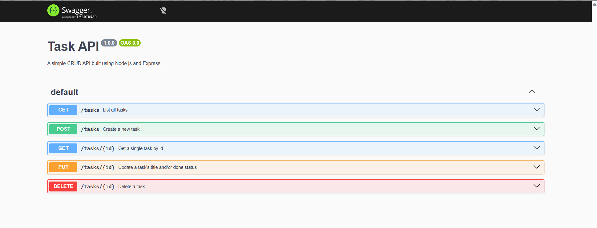

# Build your own CRUD API ->

A small REST API for managing a to-do list, built with Node.js and Express as
part of the FlyRank AI Backend Engineering internship.

Supports full CRUD (Create, Read, Update, Delete) on an in-memory task list. No database, data resets when the server restarts.

## Tech stack

- Node.js + Express
- In-memory storage (plain array, no database)
- Swagger UI (via `swagger-ui-express`) for interactive API docs

## Project Structure

```
crud-api/
│
├── src/
│   └── server.js
│
├── openapi.json
├── package.json
├── README.md
└── .gitignore
```

## How to run it

Clone the repository

```bash
git clone <repository-url>
```

Navigate to the project

```bash
cd flyrank-internship/crud-api
```

Install dependencies

```bash
npm install
```

---

## Running the Server

Development mode

```bash
npm run dev
```

Production mode

```bash
npm start
```

Server runs on

```
http://localhost:3000
```

---

## Endpoints

| Method | Path          | Description                        |
|--------|---------------|------------------------------------|
| GET    | `/`           | API info                           |
| GET    | `/health`     | Health check                       |
| GET    | `/tasks`      | List all tasks                     |
| GET    | `/tasks/:id`  | Get a single task by id             |
| POST   | `/tasks`      | Create a new task                  |
| PUT    | `/tasks/:id`  | Update a task's title and/or done  |
| DELETE | `/tasks/:id`  | Delete a task                      |

## Swagger UI

Interactive docs available at `http://localhost:3000/docs` once the server is running.



## Example request

```bash
curl -i -X POST http://localhost:3000/tasks -H "Content-Type: application/json" -d "{\"title\":\"Buy milk\"}"
```

## Author

Ayush Saxena <br>
FlyRank Backend AI Engineering Intern