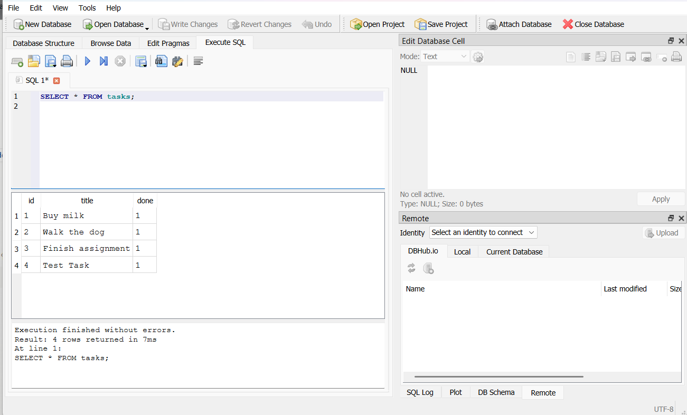
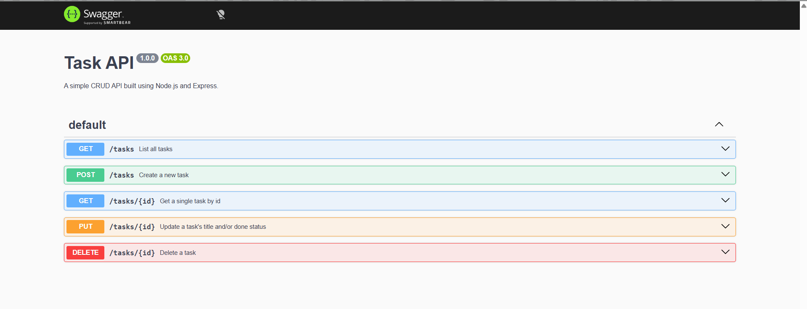

# Build your own CRUD API ->

A small REST API for managing a to-do list, built with Node.js and Express as
part of the FlyRank AI Backend Engineering internship.

Supports full CRUD (Create, Read, Update, Delete) on an in-memory task list. No database, data resets when the server restarts.

## Tech stack

- Node.js + Express
- SQLite (via `better-sqlite3`) for persistent storage
- Swagger UI (via `swagger-ui-express`) for interactive API docs

## Project Structure

```
crud-api/
│
├── src/
│   ├── app.js
│   ├── server.js
│   ├── errors.js
│   │
│   ├── routes/
│   │   ├── meta.routes.js
│   │   └── tasks.routes.js
│   │
│   ├── services/
│   │   └── tasks.service.js
│   │
│   ├── repositories/
│   │   └── tasks.repository.js
│   │
│   └── middleware/
│       └── error-handler.js
│
├── openapi.json
├── package.json
├── package-lock.json
├── README.md
└── .gitignore
```

> `tasks.db` is created automatically on first run — not committed to the repo (see `.gitignore`).


## Architecture

This project follows a layered architecture:

- **routes/** — thin HTTP handlers (read request, call service, shape response)
- **services/** — business rules and validation
- **repositories/** — data access (currently SQLite)
- **errors.js** + **middleware/** — typed domain errors mapped to HTTP status codes

Moving from an in-memory array to SQLite required changing only
`repositories/tasks.repository.js` — the routes and services layer were
untouched, since they only ever call `findAll` / `findById` / `create` /
`update` / `remove` and never cared what was behind them.

## How to run it

Clone the repository

```bash
git clone <repository-url>
```

Navigate to the project

```bash
cd flyrank-internship/crud-api
```

Install dependencies

```bash
npm install
```

---

## Running the Server

Development mode

```bash
npm run dev
```

Production mode

```bash
npm start
```

Server runs on

```
http://localhost:3000
```

---

## Endpoints

| Method | Path          | Description                        |
|--------|---------------|------------------------------------|
| GET    | `/`           | API info                           |
| GET    | `/health`     | Health check                       |
| GET    | `/tasks`      | List all tasks                     |
| GET    | `/tasks/:id`  | Get a single task by id             |
| POST   | `/tasks`      | Create a new task                  |
| PUT    | `/tasks/:id`  | Update a task's title and/or done  |
| DELETE | `/tasks/:id`  | Delete a task                      |


## Database

This project stores tasks in a SQLite database (`tasks.db`) instead of an
in-memory list — so your data survives server restarts.

**Why SQLite:** it's a single file, needs no separate server or install,
and is created automatically the first time the app runs — zero setup for
anyone cloning this repo.

`tasks.db` is created automatically in the project root on first run, with
the `tasks` table and 3 seed tasks. It's git-ignored, so every clone starts
with a fresh, clean database rather than inheriting whatever test data was
on my machine.

### Example query (run in DB Browser for SQLite)

```sql
SELECT * FROM tasks;
```

This returned all the tasks — confirming the same data and
logic works identically whether it's driven through the API or run by
hand against the raw database file.



## Swagger UI

Interactive docs available at `http://localhost:3000/docs` once the server is running.



## Example request

```bash
curl -i -X POST http://localhost:3000/tasks -H "Content-Type: application/json" -d "{\"title\":\"Buy milk\"}"
```

## Author

Ayush Saxena <br>
FlyRank Backend AI Engineering Intern