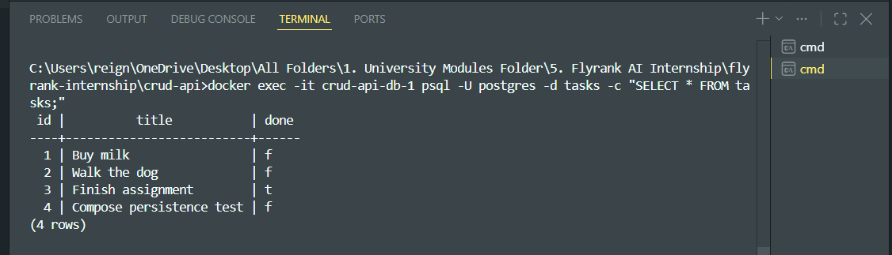
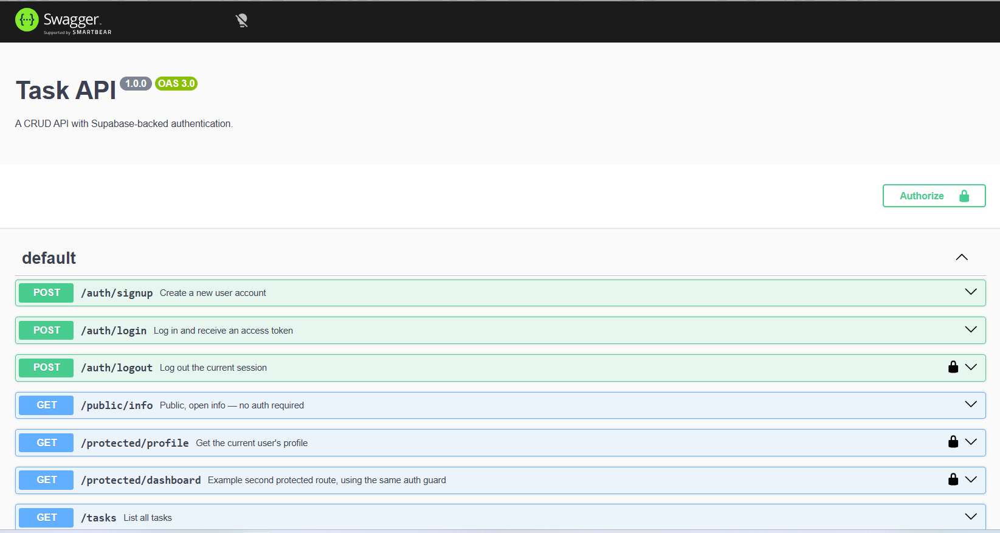
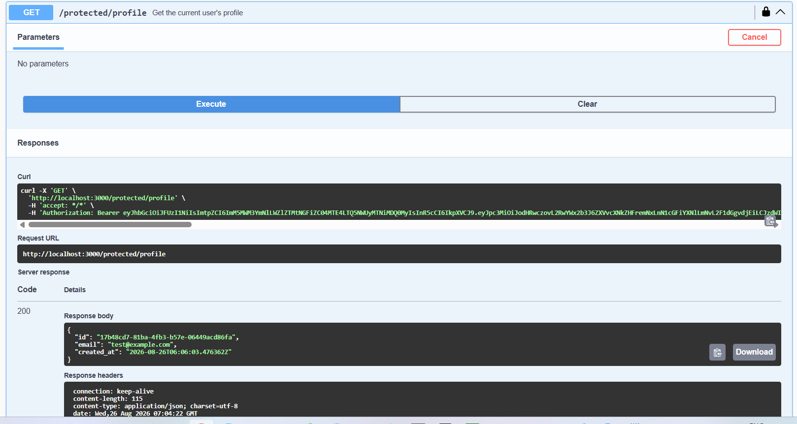

# Task API — CRUD Assignment

A REST API for managing a to-do list, built with Node.js and Express as
part of the FlyRank AI Backend Engineering internship (Backend Track).

Supports full CRUD (Create, Read, Update, Delete) on a task list, plus
user authentication. Storage and features have evolved across four
assignments in this same repo:

| Assignment | Feature | Status |
|---|---|---|
| A1 | In-memory array | Gone on restart |
| A2 | SQLite (`tasks.db`) | Survives restart, single file |
| A3 | PostgreSQL, containerized | Survives restart, real database server |
| A4 | Supabase Auth (JWT) | Signup/login/logout, protected routes |

The task API and its behavior never changed across A1-A3 — only the
`repositories/tasks.repository.js` file did, each time. A4 adds an
entirely new, separate slice of the app (auth) alongside it.

## Tech stack

- Node.js + Express
- PostgreSQL 16, running in Docker
- `pg` (node-postgres) as the database driver
- Supabase Auth (`@supabase/supabase-js`) for authentication
- Docker + Docker Compose for one-command startup
- Swagger UI (via `swagger-ui-express`) for interactive API docs

## Project Structure

```
crud-api/
│
├── src/
│ ├── app.js
│ ├── server.js
│ ├── errors.js
│ ├── supabase-client.js
│ │
│ ├── routes/
│ │ ├── meta.routes.js
│ │ ├── tasks.routes.js
│ │ └── auth.routes.js
│ │
│ ├── services/
│ │ ├── tasks.service.js
│ │ └── auth.service.js
│ │
│ ├── repositories/
│ │ └── tasks.repository.js
│ │
│ └── middleware/
│ ├── error-handler.js
│ └── auth-guard.js
│
├── openapi.json
├── package.json
├── package-lock.json
├── Dockerfile
├── compose.yaml
├── .dockerignore
├── .env.example
├── README.md
└── .gitignore
```

> `.env` (real secrets) and `tasks.db` (leftover from A2) are git-ignored.
> `.env.example` is committed with placeholder values.

## Architecture

This project follows a layered architecture:

- **routes/** — thin HTTP handlers (read request, call service, shape response)
- **services/** — business rules and validation
- **repositories/** — data access (currently PostgreSQL)
- **middleware/** — cross-cutting concerns: error handling and auth guarding
- **errors.js** — typed domain errors mapped to HTTP status codes

Each storage swap (memory → SQLite → Postgres) only ever required changing
`repositories/tasks.repository.js`. The routes and services layers have
been untouched since the original layered refactor, because they only
call `findAll` / `findById` / `create` / `update` / `remove` and never
cared what was behind them.

Auth (A4) follows the same layering, as a parallel slice: `auth.routes.js`
→ `auth.service.js` → Supabase, with a reusable `auth-guard.js` middleware
protecting any route that needs it.

## How to run it

**Requirements:** Docker Desktop (or Podman) installed and running, plus
a free [Supabase](https://supabase.com) project for auth.

```bash
git clone <repository-url>
cd flyrank-internship/crud-api
cp .env.example .env
```

Edit `.env` and fill in your own `SUPABASE_URL` and `SUPABASE_KEY` (see
[Authentication setup](#authentication) below).

```bash
docker compose up
```

That's it — one command starts both the API and its Postgres database.
The `tasks` table and 3 seed tasks are created automatically on first run.

Server runs on `http://localhost:3000`.

To stop everything:

```bash
docker compose down
```

(Add `-v` to also delete the database volume and start completely fresh
next time: `docker compose down -v`.)

## Configuration

Connection details and secrets are read from environment variables. Copy
the example file and fill in real values:

```bash
cp .env.example .env
```

| Variable | Purpose |
|---|---|
| `DATABASE_URL` | Postgres connection string |
| `SUPABASE_URL` | Your Supabase project URL |
| `SUPABASE_KEY` | Your Supabase `anon` public key (never `service_role`) |
| `PORT` | Port the server listens on (default 3000) |

`.env` is git-ignored — real credentials are never committed. When running
via `docker compose up`, `DATABASE_URL` is overridden directly in
`compose.yaml` (pointing at the `db` service by name) — the `.env` value
for it is only used when running the app outside Docker. `SUPABASE_URL`
and `SUPABASE_KEY` are always read from `.env` either way.

## Running without Docker (optional)

If you'd rather run Postgres yourself and the app directly with Node:

```bash
docker run --name taskdb -e POSTGRES_PASSWORD=dev -e POSTGRES_DB=tasks -p 5433:5432 -v taskdata:/var/lib/postgresql/data -d postgres:16
```

Make sure `.env`'s `DATABASE_URL` points at the port you used (default
example uses `5433`, to avoid colliding with a native Postgres install
on port 5432), then:

```bash
npm install
npm start
```

## Endpoints

| Method | Path              | Auth required | Description                        |
|--------|-------------------|:---:|-------------------------------------|
| GET    | `/`               | No | API info                           |
| GET    | `/health`         | No | Health check                       |
| GET    | `/tasks`          | No | List all tasks                     |
| GET    | `/tasks/:id`      | No | Get a single task by id             |
| POST   | `/tasks`          | No | Create a new task                  |
| PUT    | `/tasks/:id`      | No | Update a task's title and/or done  |
| DELETE | `/tasks/:id`      | No | Delete a task                      |
| POST   | `/auth/signup`    | No | Create a new user account |
| POST   | `/auth/login`     | No | Log in, returns an access + refresh token |
| POST   | `/auth/logout`    | Yes (Bearer) | End the current session |
| GET    | `/public/info`    | No | Open, unauthenticated data |
| GET    | `/protected/profile` | Yes (Bearer) | Returns the current user's id/email |
| GET    | `/protected/dashboard` | Yes (Bearer) | Second example protected route |

## Example request

```bash
curl -i -X POST http://localhost:3000/tasks -H "Content-Type: application/json" -d "{\"title\":\"Buy milk\"}"
```

## Database

Tasks are stored in PostgreSQL, running as its own container (not a file
on disk, unlike the SQLite version in A2). Data persists across restarts
via a named Docker volume (`taskdata`) — the container itself can be
deleted and recreated, and the data survives as long as the volume isn't
also removed.

**Why Postgres in Docker:** no local Postgres install required, no version
conflicts between machines, and it behaves identically whether it's
running on my machine or anyone else's — the exact problem containers are
built to solve.

**Persistence proof:** created a task, ran `docker compose down` (which
fully removes both containers), then `docker compose up` again — the
task was still there, because the volume, not the container, is what
holds the data.

### Example query

```sql
SELECT * FROM tasks;
```

Run via `docker exec -it crud-api-db-1 psql -U postgres -d tasks -c "SELECT * FROM tasks;"` —
returned all tasks, confirming the API and a direct database query see
identical data.



## Authentication

User accounts, password hashing, and token signing are all handled by
**Supabase Auth** — this project never stores a password or writes any
cryptography itself. The API's job is limited to forwarding signup/login
requests to Supabase, and verifying tokens Supabase issues before allowing
access to protected routes.

### Setup

Create a free project at [supabase.com](https://supabase.com), then from
**Project Settings → API**, copy your Project URL and `anon` public key
(never the `service_role` key) into `.env`:

SUPABASE_URL=your_supabase_project_url
SUPABASE_KEY=your_supabase_anon_key

For local testing, email confirmation should be turned off under
**Authentication → Providers → Email**, so a fresh signup can log in
immediately without clicking a confirmation link. (In production, you'd
leave this on.)

### How protection works

A single reusable Express middleware (`middleware/auth-guard.js`) does all
the work: it extracts the token from the `Authorization: Bearer <token>`
header, asks Supabase to verify it's genuine via `supabase.auth.getUser()`,
and either rejects with `401` or attaches the verified user to `req.user`
and lets the request continue. Adding auth to a new route is a one-line
change — `/protected/dashboard` reuses the exact same guard with zero new
auth code.

### Example flow

```bash
curl -X POST http://localhost:3000/auth/signup -H "Content-Type: application/json" -d "{\"email\":\"test@example.com\",\"password\":\"password123\"}"

curl -X POST http://localhost:3000/auth/login -H "Content-Type: application/json" -d "{\"email\":\"test@example.com\",\"password\":\"password123\"}"

curl http://localhost:3000/protected/profile -H "Authorization: Bearer <paste access_token here>"
```

A tampered or expired token returns `401` with `{"error": "Invalid or
expired token"}`; a missing token returns `401` with `{"error": "Access
token required"}`.

### Swagger

`/docs` shows a padlock icon on every protected route, and an
**Authorize** button at the top — paste a token once, then "Try it out"
on any locked endpoint without manually adding headers.





## Swagger UI

Interactive docs available at `http://localhost:3000/docs` once the server is running.


## Author

Ayush Saxena <br/>
FlyRank Backend AI Engineering Intern